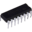

## Robson Martins
#### MBA, IT Systems Analyst/Developer, Maker

I'm a software analyst and developer, specialized in Java/SOA and with large experience in C/C++ language. Learning Data Science and Artificial Inteligence (Python, Machine Learning, NLP). Beginner in Mobile Development (Flutter, iOS and Android). Maker and Electronics Technician, with knowledge in Hardware, Embedded Electronics, IoT, Digital Electronics and Microchip PIC microcontroller development projects.

#### Programming Languages

  
  

 
 

#### Connect with me

 
 
